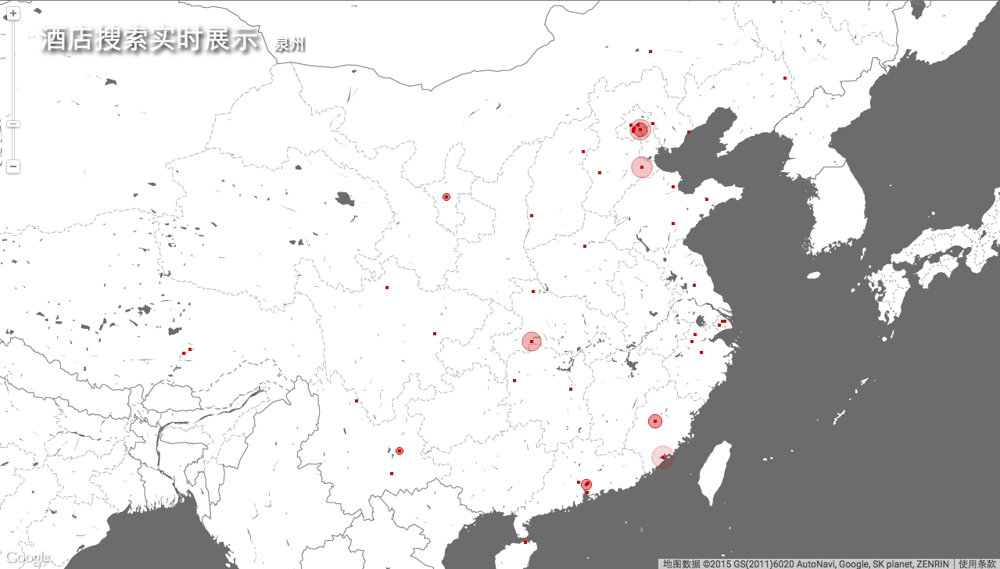

# 实时预订展示板

一个可以实时展示酒店、机票预订及位置信息的数据可视化项目
基于Google Map API实现

#### 一、酒店预订展示

- [x] 调研google map api
- [x] 调研demo效果实现代码
- [x] 完成js开发
- [x] 部署至web server（tornado）
- [ ] 对接预订实时数据接口（@shichao）

运行效果图

#### 二、机票预订展示

- [ ] 调研demo效果实现代码

----
*powered by GoogleMapAPI|Markdown*

